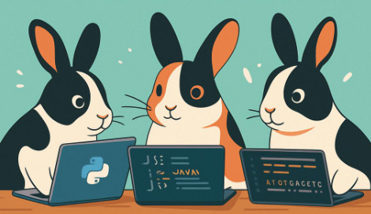

  
   
  <em>Rhinelander Rabbinary – Code Meets Care</em>

# 👋 Hi there, I’m Christina Dobbins  

Faith-rooted rabbit breeder 🐇 and software developer 💻 based in Payson, Utah.  
I combine hands-on care with practical code—building tools that make livestock care smarter and more accessible.  

---

## 🌱 About Me  
- 🎓 Software Development student (Block 6, BYU Pathway)  
- 📝 Experienced in technical documentation, workflow optimization, and troubleshooting  
- 🏡 Small business operator & property manager—resourceful and systems-driven  
- 🐇 Breeder of Rhinelander, Mini Lop, and Harlequin rabbits, focused on genetics and care  

🌐 Website: [Rhinelander Rabbitry](https://www.rhinelander-rabbitry.com)  

---

## 💻 Skills & Technologies  

  
  
  
  
  
  
  
  
  
  

**Strengths:** Documentation • Test Case Mapping • Workflow Design • Genetic Modeling  

---

## 🐇 Featured Projects  
- **Rabbit Genome Calculator** – Predicts offspring genotypes for breeders  
- **Quilt E-Commerce Site** – Full-stack project with gallery, design, and payment features  
- [**Livestock Lineup**](https://livestock-lineup.onrender.com) – Full-stack web application designed with scalability and usability in mind, streamlines the logistics of show management while providing a clear interface for exhibitors.  

---

## 🔗 Let’s Connect  
  
  
